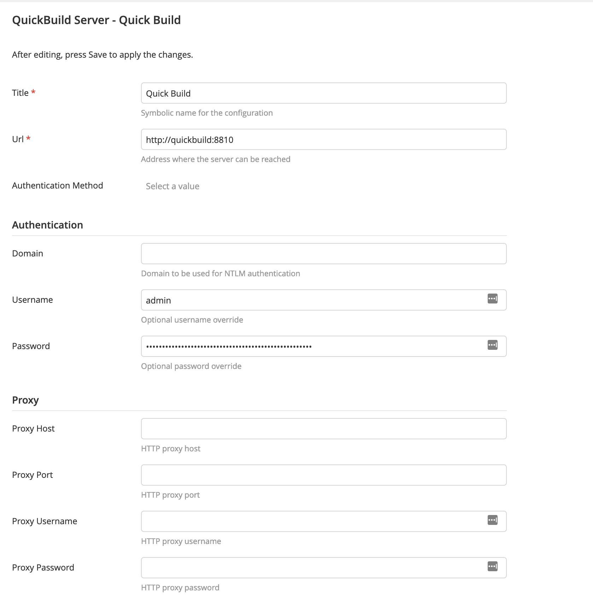
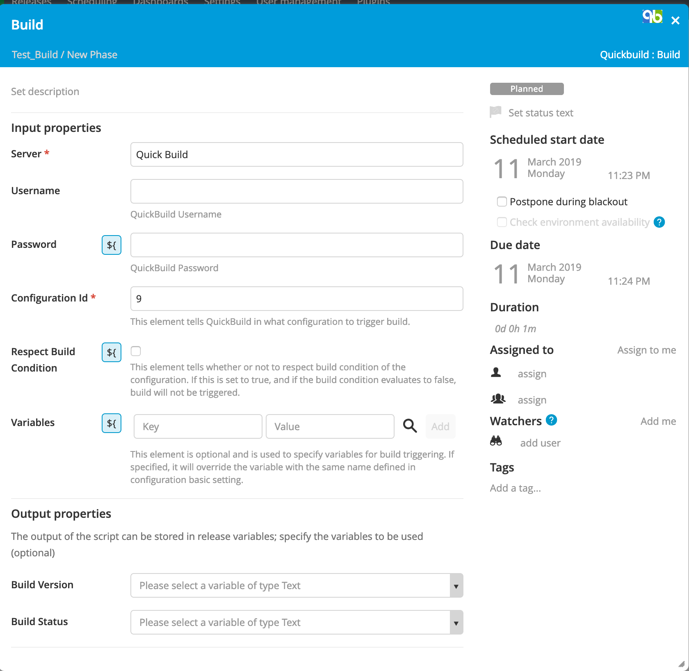
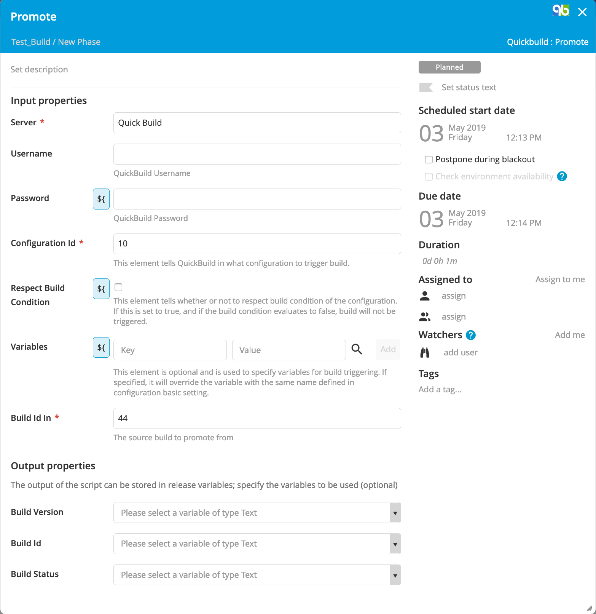

# Build status #

[![Build Status][xlr-quickbuild-plugin-travis-image] ][xlr-quickbuild-plugin-travis-url]
[![Codacy][xlr-quickbuild-plugin-codacy-image] ][xlr-quickbuild-plugin-codacy-url]
[![Code Climate][xlr-quickbuild-plugin-code-climate-image] ][xlr-quickbuild-plugin-code-climate-url]
[![License: MIT][xlr-quickbuild-plugin-license-image] ][xlr-quickbuild-plugin-license-url]
[![Github All Releases][xlr-quickbuild-plugin-downloads-image] ]()

[xlr-quickbuild-plugin-travis-image]: https://travis-ci.org/xebialabs-community/xlr-quickbuild-plugin.svg?branch=master
[xlr-quickbuild-plugin-travis-url]: https://travis-ci.org/xebialabs-community/xlr-quickbuild-plugin
[xlr-quickbuild-plugin-codacy-image]: https://api.codacy.com/project/badge/Grade/b4b6dbd57edb4344b4e32dfc76025422
[xlr-quickbuild-plugin-codacy-url]: https://www.codacy.com/app/zvercodebender/xlr-quickbuild-plugin
[xlr-quickbuild-plugin-code-climate-image]: https://codeclimate.com/github/xebialabs-community/xlr-quickbuild-plugin/badges/gpa.svg
[xlr-quickbuild-plugin-code-climate-url]: https://codeclimate.com/github/xebialabs-community/xlr-quickbuild-plugin
[xlr-quickbuild-plugin-license-image]: https://img.shields.io/badge/License-MIT-yellow.svg
[xlr-quickbuild-plugin-license-url]: https://opensource.org/licenses/MIT
[xlr-quickbuild-plugin-downloads-image]: https://img.shields.io/github/downloads/xebialabs-community/xlr-quickbuild-plugin/total.svg

## Preface

This plugin manages the integration to Quick Build.

## Overview

### Features

#### Server configuration

#### Build Task

#### Promote Task

## References

1. [Quick Build RESTful+API](https://wiki.pmease.com/display/QB50/RESTful+API)
